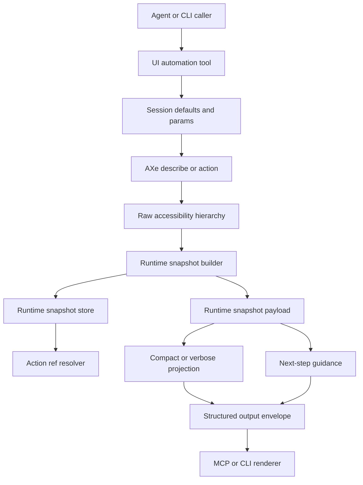

import { PageHeader } from "../_components/page-header"

<PageHeader
  breadcrumbs={["Docs", "Contributing", "Architecture", "UI Automation"]}
  title="UI Automation"
  lede="How MobileBuildMCP turns raw accessibility output into stable runtime snapshots, safe actions, post-action captures, and agent-oriented next-step guidance."
/>

UI automation is the part of MobileBuildMCP where an agent can inspect an app, choose elements, and perform gestures without shelling out to Simulator or AXe directly. The contributor goal is not to make one app easy to drive. The goal is to preserve an app-agnostic model of what the UI exposes, what actions are valid, and which follow-up actions are most useful.

This page documents the end-to-end flow, the domain model, and the business rules that keep UI automation predictable.

## Terms used here

- **AXe**: The bundled accessibility helper that returns raw accessibility hierarchy and performs low-level UI actions.
- **raw accessibility hierarchy**: The JSON tree returned by AXe. It can include nested children, frames, labels, values, identifiers, roles, state, and custom actions.
- **runtime snapshot**: MobileBuildMCP's normalized, public, model-facing UI state. It contains refs, roles, frames, actions, text, screen hash, and sequence. Normal output renders a compact projection; CLI JSON `--verbose` can expose the full public `elements` and `actions` arrays.
- **element ref**: A short per-snapshot identifier such as `e18`. It is only valid for the runtime process and snapshot sequence that produced it.
- **runtime snapshot store**: The in-memory per-simulator record that maps refs back to private metadata and raw nodes for action execution within the current runtime process.
- **action result**: The structured result from `tap`, `swipe`, `type_text`, `batch`, and related tools. It includes the action outcome and, when available, a post-action runtime snapshot.
- **next step**: A suggested follow-up command rendered for agents and humans. It is guidance, not the canonical UI state.

For the canonical glossary, see [Core terms](/docs/architecture#core-terms).

## High-level architecture



The runtime snapshot is the source of truth for what the caller can see. Next steps are a recommendation layer on top of that source of truth.

## End-to-end flow

### 1. Capture UI state

`snapshot_ui` asks AXe to describe the current UI for a simulator. The raw hierarchy is parsed into a runtime snapshot record.

The snapshot builder:

1. Flattens the AX hierarchy into ordered public refs: `e1`, `e2`, `e3`, and so on.
2. Normalizes role, label, value, identifier, frame, and state.
3. Derives actions such as `tap`, `typeText`, `longPress`, `touch`, and `swipeWithin`.
4. Applies viewport visibility rules so off-screen or clipped elements do not advertise unsafe point actions.
5. Infers scrollable containers when the AX role does not expose an obvious scroll view but descendants overflow.
6. Creates a screen hash and sequence number.
7. Stores private metadata by ref for later action execution.

Source files:

- `src/mcp/tools/ui-automation/snapshot_ui.ts`
- `src/mcp/tools/ui-automation/shared/runtime-snapshot.ts`
- `src/mcp/tools/ui-automation/shared/snapshot-ui-state.ts`

### 2. Render public output

By default, runtime snapshots are compacted before they reach agents. Instead of returning every public element, normal output groups the most useful elements into lists such as:

```text
targets: e102|tap|button|Close||xmark
scroll:  e99|swipe|scroll-view|||activePanel
text:    e130|text|text|Example value||
```

The format is:

```text
ref | action | role | label | value | identifier
```

Business rules:

- Keep the structured output envelope stable.
- Compact large UI data inside `data.capture`, not by bypassing the envelope.
- Treat compact output as a projection only; the stored runtime snapshot still contains all refs from the capture.
- CLI JSON `--verbose` may expose the full public runtime snapshot under `data.capture.elements` and `data.capture.actions`.
- Do not include raw AX nodes in public output, even in verbose mode.
- Keep refs short because agents use them in follow-up calls.

### 3. Resolve actions from refs

Action tools accept refs from the latest stored runtime snapshot. A ref is resolved through the per-simulator runtime snapshot store.

Action execution validates that:

- the snapshot exists and is not expired,
- the ref exists in that snapshot,
- the requested action is listed for that ref,
- the element is visible enough for the action,
- the action point or swipe path is non-degenerate.

For `swipe`, the optional `distance` parameter is a normalized fraction greater than 0 and up to 1 of the safe target stroke. For example, `0.5` uses half of the computed safe stroke and `0.8` uses a longer stroke. MobileBuildMCP computes the final endpoints and does not forward this public value as AXe `--delta`.

If validation fails, the tool returns a structured recovery error instead of guessing another element.

Source files:

- `src/mcp/tools/ui-automation/tap.ts`
- `src/mcp/tools/ui-automation/swipe.ts`
- `src/mcp/tools/ui-automation/type_text.ts`
- `src/mcp/tools/ui-automation/batch.ts`
- `src/mcp/tools/ui-automation/shared/runtime-snapshot.ts`
- `src/mcp/tools/ui-automation/shared/snapshot-ui-state.ts`

### 4. Capture after actions

Successful mutating UI action tools attempt a post-action capture. This gives the agent a fresh screen hash, fresh refs, and fresh next steps without requiring an immediate extra `snapshot_ui` call.

Business rules:

- Post-action capture is normal success-path behavior, not a license to reuse stale refs.
- Fresh refs replace old refs after UI changes.
- Do not preserve cached snapshots as a success-path optimization for mutating UI actions.
- If post-action capture fails, the action result should still report the action outcome and a structured recovery path where possible.
- Agents should refresh or wait after navigation, search results, sheet transitions, and layout changes before relying on new refs.

Source files:

- `src/mcp/tools/ui-automation/shared/post-action-snapshot.ts`
- `src/mcp/tools/ui-automation/shared/domain-result.ts`

### 5. Generate next steps

Next steps are generated after the snapshot or action result exists. They are not part of snapshot construction. They are model-facing examples that help the caller choose a useful next command.

Source file:

- `src/mcp/tools/ui-automation/shared/runtime-next-steps.ts`

Business rules:

- Next-step refs must come from the current runtime snapshot only.
- Prefer runtime tap and scroll guidance over screenshot suggestions.
- Suggest screenshots only when no useful runtime action exists.
- Avoid generic tap suggestions for text fields, hidden controls, and state-changing controls.
- Prefer foreground controls when the raw snapshot includes background controls behind a sheet, panel, or detail view.
- Be conservative when foreground detection is not confident.

## Runtime snapshot domain logic

Runtime snapshots answer: what is currently on screen, and what actions are valid?

### Ref assignment

Refs are assigned by flattening the hierarchy in traversal order. The first element is `e1`, the second is `e2`, and so on.

Business rules:

- Refs are short for agent ergonomics.
- Refs are only stable within the current snapshot sequence.
- Refs must not be treated as durable selectors across screen changes.

### Role derivation

The builder derives a normalized runtime role from AX role-like fields such as role, type, subrole, and role description.

Examples of normalized roles:

- `application`
- `window`
- `button`
- `text-field`
- `text`
- `switch`
- `tab`
- `cell`
- `scroll-view`
- `list`
- `other`

Business rules:

- Prefer a small role vocabulary over leaking every AX role variant.
- Use roles to derive actions and help agents reason about the element.
- Preserve app-provided labels, values, and identifiers separately.

### Action derivation

The builder derives public actions from role, visibility, enabled state, custom actions, and semantic identity.

Business rules:

- Disabled or invisible elements advertise no actions.
- Tap-like roles advertise `tap` when visible and enabled.
- Text fields advertise `typeText`.
- Non-window, non-application elements can advertise `longPress` and `touch`.
- Scroll views, lists, and cells can advertise `swipeWithin`.
- Elements with custom actions may advertise `tap` only when they have semantic identity.

### Visibility and activation points

The builder compares element frames to the viewport and adjusts action availability.

Business rules:

- Elements outside the viewport lose actions.
- Elements whose default activation point is outside the viewport keep only safe scroll actions.
- Switches use a right-side activation point because the tappable control is normally on the trailing edge.
- Bottom-clipped controls can receive an adjusted activation point when a safe point remains inside both the element and viewport.

### Scroll inference

Not every app exposes perfect scroll roles. The snapshot builder infers scroll targets from layout when needed.

Business rules:

- Existing `scroll-view`, `list`, and `cell` roles can expose `swipeWithin` directly.
- Large container-like elements can become inferred scroll targets when descendants overflow their frame.
- Top-level application or window roots can expose viewport scrolling only when semantic descendants overflow vertically and no better descendant scroll target exists.
- Application or window roots can get a special swipe frame when a sheet grabber descendant indicates a sheet-style gesture region, but real descendant scroll containers remain preferred for guidance.
- Generic fallback scroll targets are pruned when a better identified swipe target exists.

## Next-step domain logic

Next steps answer: what should an agent probably try next?

That is deliberately different from runtime snapshot logic. A valid background button can stay in `capture.targets`, while next steps prefer a foreground panel's controls.

### Tap ranking

Tap next steps start from current elements that advertise `tap`.

Business rules:

- Skip text fields for generic tap suggestions because `type_text` is usually the meaningful action.
- Skip hidden controls such as sheet grabbers.
- Skip state-changing controls such as switches and selected segments because random toggling can be destructive.
- Prefer content-rich cards and rows.
- Deprioritize screen-changing controls such as back, cancel, done, settings, menu, home, next, and previous.
- Deprioritize utility or destructive controls such as close, clear, remove, delete, and calculator operators.

### Foreground filtering

Foreground filtering reduces background noise when a sheet, panel, or detail view is active.

Business rules:

- Prefer AX hierarchy path membership when it identifies descendants of a foreground root.
- Fall back to frame containment for flattened AX trees.
- A candidate must not be larger than the foreground root when using geometry containment.
- A foreground root must contain at least one generic foreground cue:
  - close, back, cancel, or done,
  - text entry,
  - state-changing controls.
- Dismiss controls score highest, text entry scores next, state controls score lower.
- Depth and later traversal order break ties.
- If no confident foreground root exists, keep all elements rather than hiding valid controls.

### Scroll next steps

Scroll next steps rank the scrollable elements left after foreground filtering.

Business rules:

- The selected ref must advertise `swipeWithin`.
- Scroll guidance should prefer foreground candidates when foreground filtering is confident.
- Prefer real `list` and `scroll-view` descendants over semantic inferred containers.
- Use application or window root scrolling last, as a fallback when no better descendant target is available.
- Screenshot fallback should not appear when a scroll action is available.

## Error and recovery behavior

UI automation should fail loudly when a requested action cannot be performed.

Business rules:

- Do not silently choose a different ref when the requested ref is stale or not actionable.
- Return structured recovery errors such as missing snapshot, stale UI, ambiguous target, or target not actionable.
- Include current candidates when that helps the agent recover.
- Preserve the structured output envelope for errors.

## Structured output contract

The UI automation tools return structured output under the normal MobileBuildMCP envelope.

Relevant schemas:

- `mobilebuildmcp.output.capture-result`
- `mobilebuildmcp.output.ui-action-result`

Contributor rules:

- Keep `schema`, `schemaVersion`, `didError`, and `error` intact.
- Compact UI data inside `data.capture` rather than changing the envelope shape.
- Update schemas and fixtures when public structured output intentionally changes.
- CLI JSON `--verbose` for UI action results uses the schema version that includes full runtime snapshot captures.
- Do not update snapshot fixtures to hide regressions.

## Testing strategy

UI automation behavior needs several test layers.

| Concern | Test shape |
|---------|------------|
| Runtime snapshot parsing | Unit tests for hierarchy flattening, role derivation, actions, visibility, scroll inference, and hashing. |
| Action validation | Unit tests around stale refs, missing snapshots, non-actionable targets, activation points, and recovery errors. |
| Next-step guidance | Unit tests for tap ranking, screenshot suppression, foreground filtering, and scroll suggestion behavior. |
| Rendering contracts | Snapshot tests for MCP, CLI text, JSON, and schema output. |
| Agent behavior | Manual or scripted validation runs with real agents on realistic apps. |

## Contributor rules

- Keep runtime snapshots canonical and neutral. They describe valid UI state.
- Keep next-step guidance separate. It recommends useful actions but must not hide valid snapshot data.
- Do not add app-specific labels, identifiers, or test-only hints to production logic.
- Prefer generic AX structure, role, state, action, and geometry signals.
- Treat refs as per-snapshot handles, not durable selectors.
- Prefer structured errors over fallback behavior.
- If a rule only improves one app, do not add it here.

## Related

- [Tool Lifecycle](/docs/architecture-tool-lifecycle), handler and next-step contracts
- [Rendering & Output](/docs/architecture-rendering-output), how structured output and next steps are rendered
- [Schema Versioning](/docs/schema-versioning), public schema contract changes
- [Testing](/docs/testing), fixture and snapshot expectations
